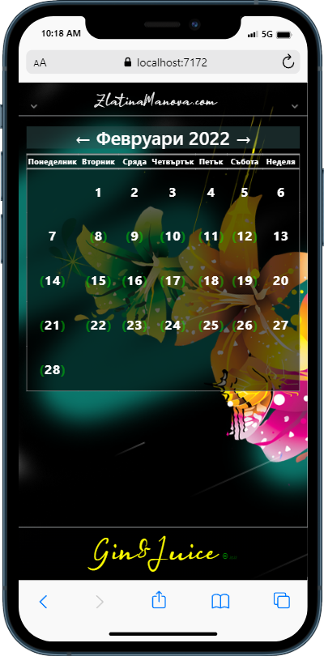
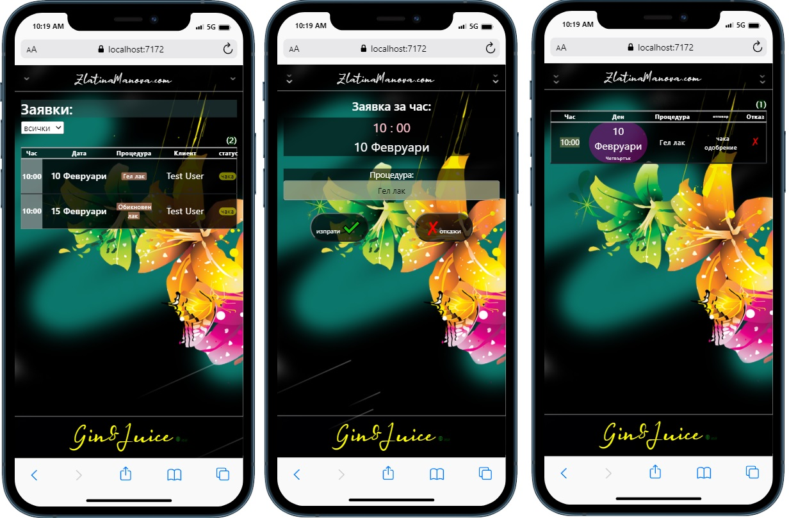
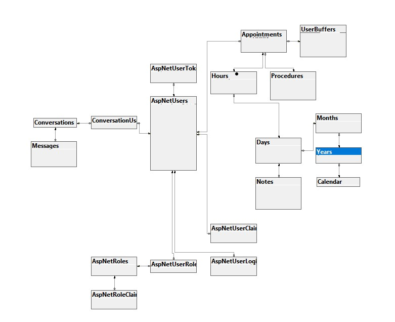

  # Notebook
  Asp.NET Web project for nail artist Zlatina Manova and her clients.
  Mobile-responsible web designed pages. (33% project progress)
  
  
  
  Start project:
  Migrations are added in solution, when you start the project, the auto-update of the database is going to procceed.
  Owner of the project is added and you can log-in with owners email : `alekszarev@aol.com` 
                                                        and password : `1234567`
 
 Client registration => Identity registration with email and password.
                     => Forgot password email sender included.
 
 Calendar => Owner and clients can query appointments. Client can set only one appointment until day of already setted one.
            - Approvement of clients query is in the owner part.
 
            
         
 Day => Both owner and clients can switch through days and see if there are available hours for setting appointments.           
     - Owner can set appointment with buffer user details if needed.
     
 My appointment => Client side where appointment is shown. Approved or waiting for approvement and when the exact hour is.
                => Owner can approve or delete queries.
  
 

 
  ## Table:
  

(TODO:)
 
 Message system, Notes, Notifications.
